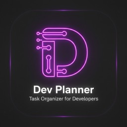

<p align="center">
  
</p>

<h1 align="center">Dev Planner</h1>

<p align="center">
  <strong>🚀 Visual Task & Project Planning Tool</strong>
</p>

<p align="center">
  <a href="README.md">🇬🇧 English</a> •
  <a href="README.ru.md">🇷🇺 Русский</a>
</p>

<p align="center">
  <a href="https://github.com/prisset/Dev-Planner/releases/latest">
    
  </a>
  <a href="https://github.com/prisset/Dev-Planner/actions">
    
  </a>
  <a href="https://github.com/prisset/Dev-Planner/blob/main/LICENSE">
    
  </a>
</p>

<p align="center">
  <a href="#-features">Features</a> •
  <a href="#-installation">Installation</a> •
  <a href="#-usage">Usage</a> •
  <a href="#-building">Building</a>
</p>

---

## ✨ Features

<table>
<tr>
<td width="50%">

### 🎯 Visual Task Management
- Create and organize tasks on an infinite canvas
- Connect tasks with visual relationships
- Drag and drop interface
- Zoom and pan navigation

</td>
<td width="50%">

### 📝 Note Mode
- Quick notes without titles
- Focus on content
- Compact view

</td>
</tr>
<tr>
<td width="50%">

### 💾 Project Management
- Multiple projects support
- Auto-save functionality
- JSON export/import

</td>
<td width="50%">

### 🎨 Modern Design
- Glassmorphism UI
- Dark theme
- Smooth animations

</td>
</tr>
</table>

## 📥 Installation

### Windows

1. Download **`Dev.Planner.Setup.exe`** from the [latest release](https://github.com/prisset/Dev-Planner/releases/latest)
2. Run the installer
3. Follow the installation wizard
4. Launch from Start Menu or Desktop shortcut

### macOS

1. Download **`Dev.Planner.macOS.dmg`** from the [latest release](https://github.com/prisset/Dev-Planner/releases/latest)

2. **Remove quarantine** (required for unsigned apps):
   ```bash
   xattr -cr ~/Downloads/Dev.Planner.macOS.dmg
   ```

3. Open the DMG file

4. Drag **Dev Planner** to **Applications**

5. **First launch**: Right-click → Open → Open

> ⚠️ **Note**: The app is not signed with Apple Developer certificate. macOS will show a warning on first launch. Use right-click → Open to bypass Gatekeeper.

## 🎮 Usage

### Basic Controls
| Action | Control |
|--------|---------|
| Create Task | Double-click on canvas |
| Move Task | Drag with mouse |
| Connect Tasks | Right-click → Connect, then click target |
| Delete Task | Click × button |
| Zoom | Mouse wheel or +/- buttons |
| Pan | Middle mouse button or Shift+drag |

### Status Colors
- 🔴 **Todo** - Not started
- 🟡 **Progress** - In progress  
- 🟢 **Done** - Completed
- ⚫ **None** - No status

## 🔧 Building

### Requirements
- Qt 6.6+
- CMake 3.20+
- C++17 compiler

### Build Steps

```bash
cd cpp
mkdir build && cd build
cmake .. -DCMAKE_BUILD_TYPE=Release
make -j$(nproc)
```

### Windows (MSVC)
```powershell
cd cpp
mkdir build && cd build
cmake .. -G "NMake Makefiles" -DCMAKE_BUILD_TYPE=Release
nmake
windeployqt DevPlanner.exe
```

## 📄 License

MIT License - see [LICENSE](LICENSE) for details.

---

<p align="center">
  Made with ❤️ by <a href="https://github.com/prisset">prisset</a>
</p>
