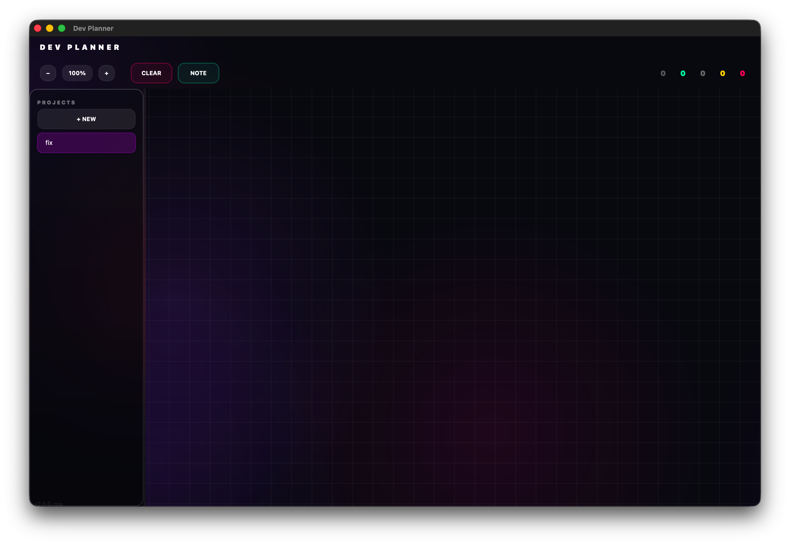

<p align="center">
  
</p>

<h1 align="center">Dev Planner</h1>

<p align="center">
  <strong>Visual Task & Project Planning Tool</strong>
</p>

<p align="center">
  <a href="README.md">English</a> •
  <a href="README.ru.md">Русский</a>
</p>

---

## Screenshots

<p align="center">
  
</p>

## Features

### Visual Task Management
- Create and organize tasks on an infinite canvas
- Connect tasks with visual relationships
- Drag and drop interface
- Zoom and pan navigation

### Note Mode
- Quick notes without titles
- Focus on content
- Compact view

### Project Management
- Multiple projects support
- Auto-save functionality
- JSON export/import

### Modern Design
- Glassmorphism UI
- Dark theme
- Smooth animations

## Installation

### Windows

1. Download **`Dev.Planner.Setup.exe`** from the [latest release](https://github.com/prisset/Dev-Planner/releases/latest)
2. Run the installer
3. Follow the installation wizard
4. Launch from Start Menu or Desktop shortcut

### macOS

1. Download **`Dev.Planner.macOS.dmg`** from the [latest release](https://github.com/prisset/Dev-Planner/releases/latest)

2. **Remove quarantine** (required for unsigned apps):
   ```bash
   xattr -cr ~/Downloads/Dev.Planner.macOS.dmg
   ```

3. Open the DMG file

4. Drag **Dev Planner** to **Applications**

5. **First launch**: Right-click → Open → Open

> **Note**: The app is not signed with Apple Developer certificate. macOS will show a warning on first launch. Use right-click → Open to bypass Gatekeeper.

## Usage

### Basic Controls
| Action | Control |
|--------|---------|
| Create Task | Double-click on canvas |
| Move Task | Drag with mouse |
| Connect Tasks | Right-click → Connect, then click target |
| Delete Task | Click × button |
| Zoom | Mouse wheel or +/- buttons |
| Pan | Middle mouse button or Shift+drag |

### Status Colors
- **Todo** - Not started
- **Progress** - In progress  
- **Done** - Completed
- **None** - No status

## Building

### Requirements
- Qt 6.6+
- CMake 3.20+
- C++17 compiler

### Build Steps

```bash
cd cpp
mkdir build && cd build
cmake .. -DCMAKE_BUILD_TYPE=Release
make -j$(nproc)
```

## License

MIT License - see [LICENSE](LICENSE) for details.

---

<p align="center">
  Made with ❤️ by <a href="https://github.com/prisset">prisset</a>
</p>
