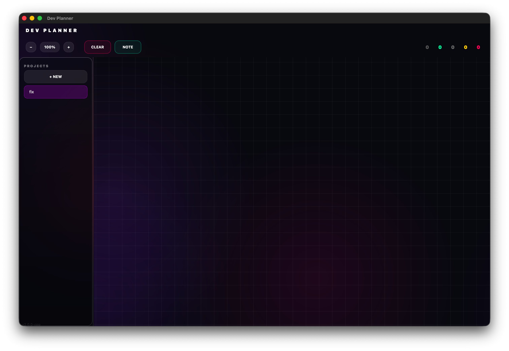

# Dev Planner

**Визуальный инструмент планирования задач и проектов**

[English](README.md) • [Русский](README.ru.md)

---

## Скриншоты



## Возможности

### Визуальное управление задачами
- Создавайте и организуйте задачи на бесконечном холсте
- Соединяйте задачи визуальными связями
- Перетаскивание мышью
- Масштабирование и панорамирование

### Режим заметок
- Быстрые заметки без заголовков
- Фокус на содержимом
- Компактный вид

### Управление проектами
- Поддержка нескольких проектов
- Автосохранение
- Экспорт/импорт JSON

### Современный дизайн
- Glassmorphism UI
- Тёмная тема
- Плавные анимации

## Установка

### Windows

1. Скачайте **`Dev.Planner.Setup.exe`** из [последнего релиза](https://github.com/prisset/Dev-Planner/releases/latest)
2. Запустите установщик
3. Следуйте инструкциям мастера установки
4. Запустите из меню Пуск или с рабочего стола

### macOS

1. Скачайте **`Dev.Planner.macOS.dmg`** из [последнего релиза](https://github.com/prisset/Dev-Planner/releases/latest)

2. **Снимите карантин** (обязательно для неподписанных приложений):
   ```bash
   xattr -cr ~/Downloads/Dev.Planner.macOS.dmg
   ```

3. Откройте DMG файл

4. Перетащите **Dev Planner** в **Программы**

5. **Первый запуск**: Правый клик → Открыть → Открыть

> **Примечание**: Приложение не подписано сертификатом Apple Developer. macOS покажет предупреждение при первом запуске. Используйте правый клик → Открыть для обхода Gatekeeper.

## Использование

### Основные элементы управления
| Действие | Управление |
|----------|------------|
| Создать задачу | Двойной клик на холсте |
| Переместить задачу | Перетащить мышью |
| Соединить задачи | ПКМ → Соединить, затем клик на цель |
| Удалить задачу | Кнопка × |
| Масштаб | Колесо мыши или кнопки +/- |
| Панорама | Средняя кнопка мыши или Shift+перетаскивание |

### Цвета статусов
- **Todo** - Не начато
- **Progress** - В работе
- **Done** - Завершено
- **None** - Без статуса

## Сборка

### Требования
- Qt 6.6+
- CMake 3.20+
- Компилятор C++17

### Шаги сборки

```bash
cd cpp
mkdir build && cd build
cmake .. -DCMAKE_BUILD_TYPE=Release
make -j$(nproc)
```

## Лицензия

MIT License - см. [LICENSE](LICENSE) для деталей.

---

Сделано [prisset](https://github.com/prisset)
